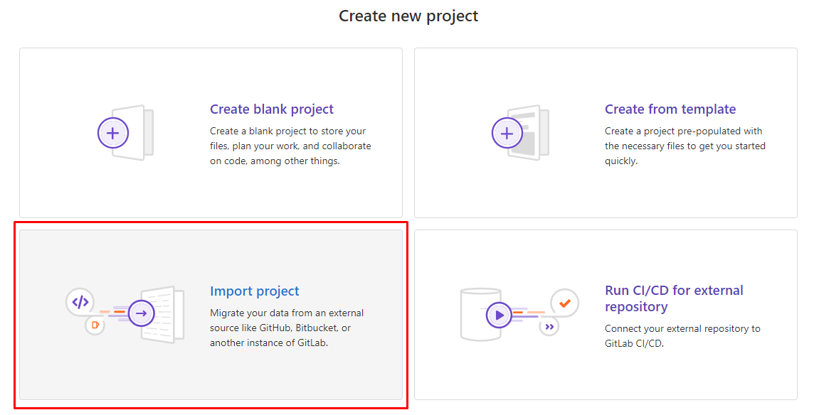
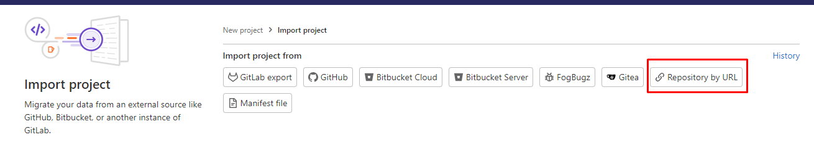
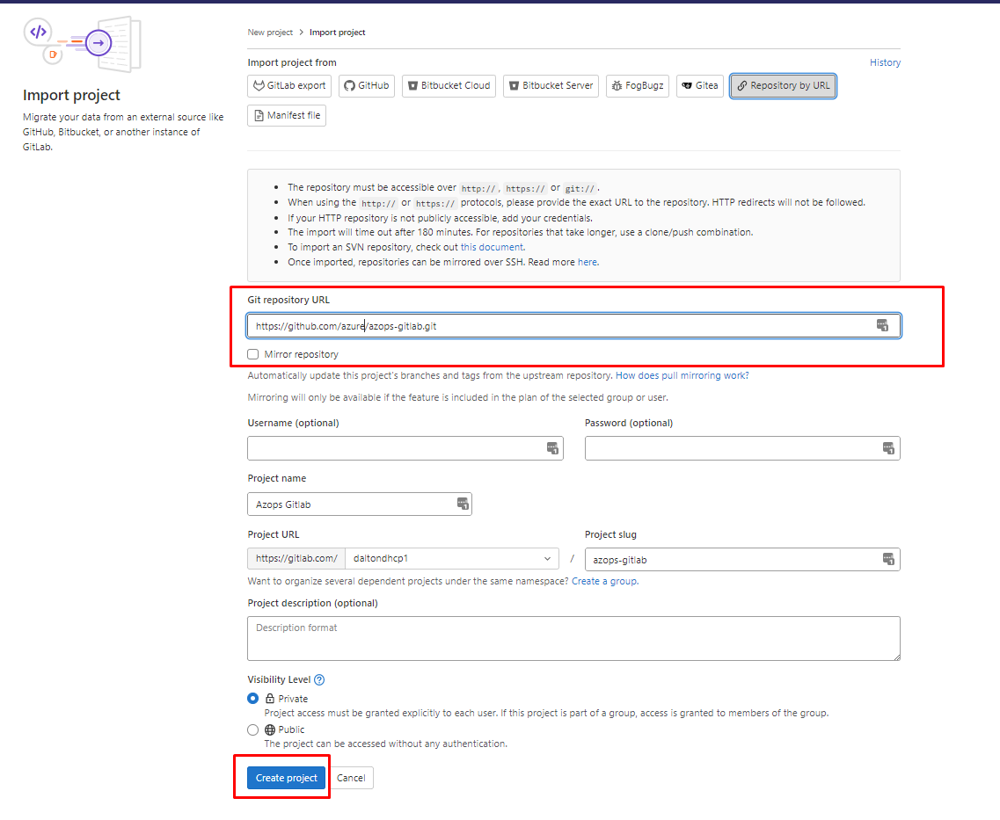
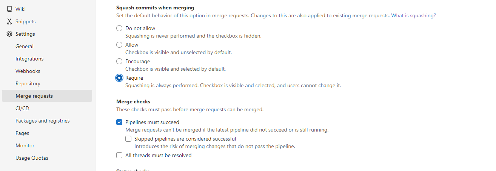
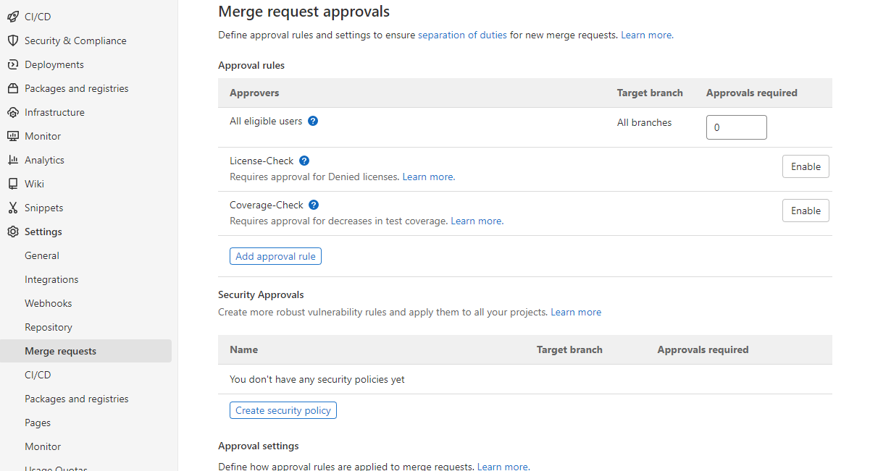
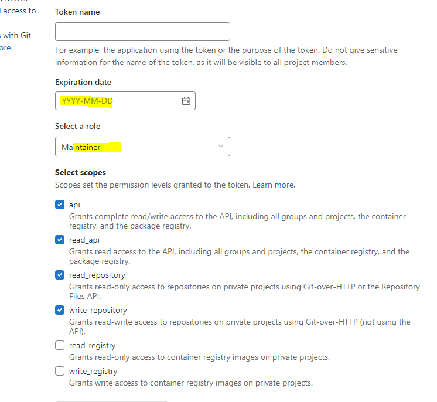
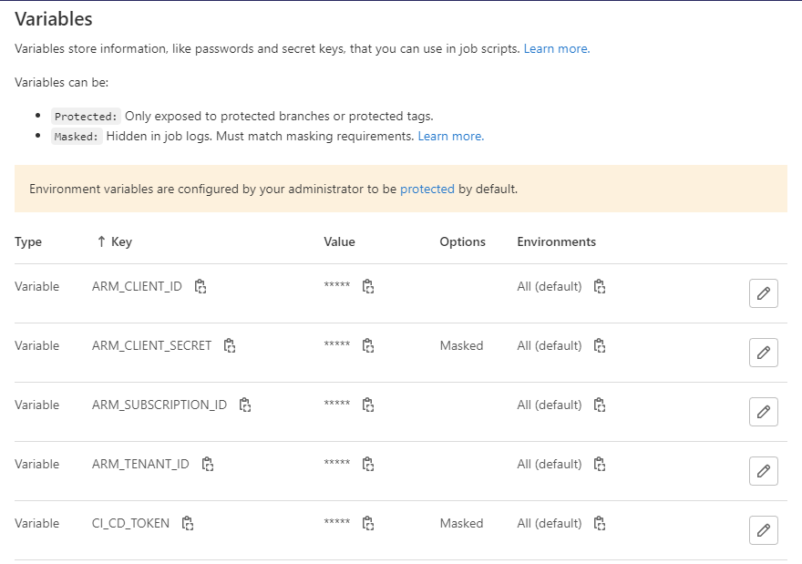
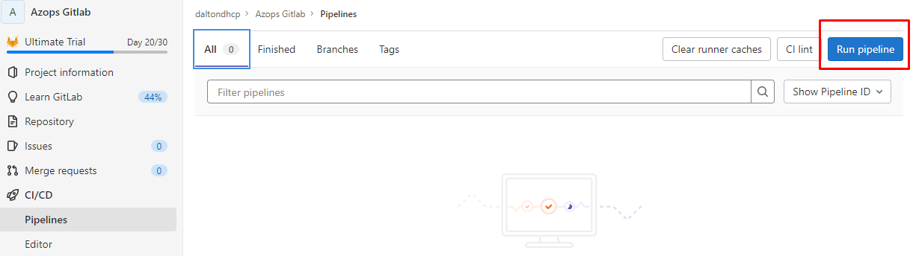
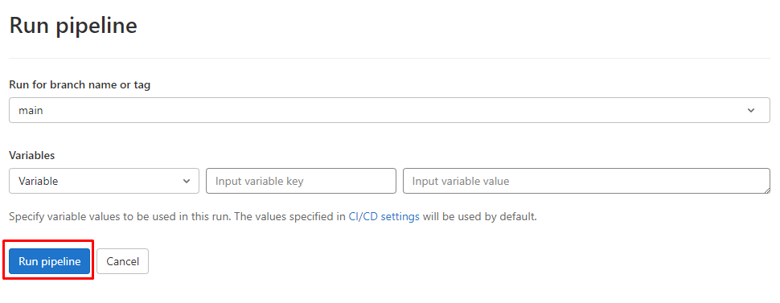

# PowerOps-Starter for GitLab

The accelerated way to get started with Infrastructure as Code (IaC) for the Power Platform.

Through the Push/Pull workflows, we enable a GitOps style management of Power Platform, but also enable interoperability with your preferred client such Admin Center, PS or CLI, still maintaining the source of truth for all artifacts in Git.

This repository contains scripts, starter pipelines and instructions on how to get started with PowerOps on GitLab.
*Note that the pipelines have only been validated in GitLab cloud.*


## Prerequisites

PowerOps requires a Service Principal for pipeline interaction with the Power Platform. `ARM_CLIENT_ID`,`ARM_CLIENT_SECRET`,`ARM_TENANT_ID`.

> Note: The actions below must be executed with a user that have at least [Contributor](https://docs.microsoft.com/en-us/azure/role-based-access-control/built-in-roles#contributor) access to an Azure subscription and [Power Platform Administrator](https://docs.microsoft.com/en-us/power-platform/admin/use-service-admin-role-manage-tenant#power-platform-administrator) or [Global Administrator](https://docs.microsoft.com/en-us/azure/active-directory/roles/permissions-reference#global-administrator) permissions in Azure AD.

```powershell
# Connect to Azure
Install-Module -Name Az.Accounts -Force
Connect-AzAccount
# Create Service Principal
$servicePrincipalDisplayName = "PowerOps"
$servicePrincipal = New-AzADServicePrincipal -DisplayName $servicePrincipalDisplayName

Write-Host "ARM_TENANT_ID: $((Get-AzContext).Tenant.Id)"
Write-Host "ARM_SUBSCRIPTION_ID: $((Get-AzContext).Subscription.Id)"
Write-Host "ARM_CLIENT_ID: $($servicePrincipal.AppId)"

# Install PowerOps module to grant the SPN access to the Power Platform
Install-Module -Name PowerOps -Force

# Register Admin management application
Register-PowerOpsAdminApplication -ClientId $servicePrincipal.AppId
```

## 1. Import/create project from repository by URL

- Create a new project and select the import project option.

- Select to import repository by URL

- Add the Git repository URL `https://github.com/daltondhcp/powerops-gitlab-starter.git` and change project/repository name as per requirements

[Reference from GitLab documentation](https://docs.gitlab.com/ee/user/project/import/repo_by_url.html)

## 2. Configure project settings

- Open the newly created project and navigate to Settings -> Merge requests and configure squash commit requirements as well as merge checks

- **[Optional]** Depending on your security requirements, you might also want to configure merge request approvals.


## 3. Create project access token

- Under Settings -> Access Tokens, create a [project access token](https://docs.gitlab.com/ee/user/project/settings/project_access_tokens.html#create-a-project-access-token).
The token will be used in the pipeline to interact with the GitLab APIs and the repository. Give the token the maintainer role and `api`,`read_api`,`read_repository` and `write_repository` scope permissions.


 > Note: Project access tokens are not available with a GitLab trial license.

- Copy the access token value, you will need it in the next step.

## 4. Create required CI/CD variables

- Under Settings -> CI/CD, create the following variables for Azure and GitLab access.

> Note: Do not create any of the variables with the 'Protect variable' flag enabled. As such variables can't be used in merge request scenarios, it will break the validate pipeline.

| Key | Value | Flags |
| --- | ---| ---|
|ARM_CLIENT_ID| Client id from service principal creation| |
|ARM_CLIENT_SECRET| Client secret from service principal creation| Mask variable |
|ARM_TENANT_ID| Azure AD tenant ID from service principal creation | |
|CI_CD_TOKEN| Project access token from previous step | Mask variable |



## 5. Run initial pull pipeline to bootstrap repository

- Navigate to CI/CD -> Pipelines -> Run pipeline -> Run pipeline to kick off the initial Pull pipeline that will bootstrap the repository based on your Azure hierarchy and settings.



After successful pipeline run, there will be a representation of the Power Platform artifacts in the repository. 

## Contributing

This project welcomes contributions and suggestions.  Most contributions require you to agree to a
Contributor License Agreement (CLA) declaring that you have the right to, and actually do, grant us
the rights to use your contribution. For details, visit <https://cla.opensource.microsoft.com>.

When you submit a pull request, a CLA bot will automatically determine whether you need to provide
a CLA and decorate the PR appropriately (e.g., status check, comment). Simply follow the instructions
provided by the bot. You will only need to do this once across all repos using our CLA.

This project has adopted the [Microsoft Open Source Code of Conduct](https://opensource.microsoft.com/codeofconduct/).
For more information see the [Code of Conduct FAQ](https://opensource.microsoft.com/codeofconduct/faq/) or
contact [opencode@microsoft.com](mailto:opencode@microsoft.com) with any additional questions or comments.

## Trademarks

This project may contain trademarks or logos for projects, products, or services. Authorized use of Microsoft
trademarks or logos is subject to and must follow
[Microsoft's Trademark & Brand Guidelines](https://www.microsoft.com/en-us/legal/intellectualproperty/trademarks/usage/general).
Use of Microsoft trademarks or logos in modified versions of this project must not cause confusion or imply Microsoft sponsorship.
Any use of third-party trademarks or logos are subject to those third-party's policies.
